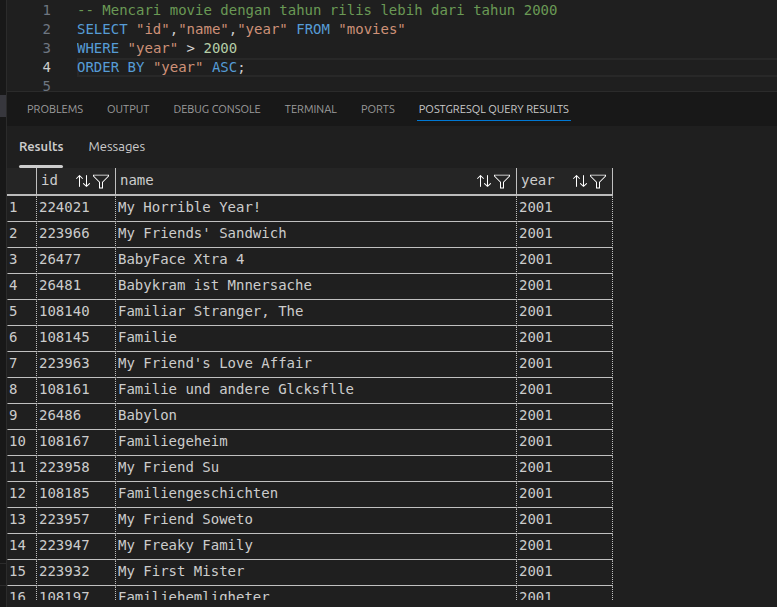
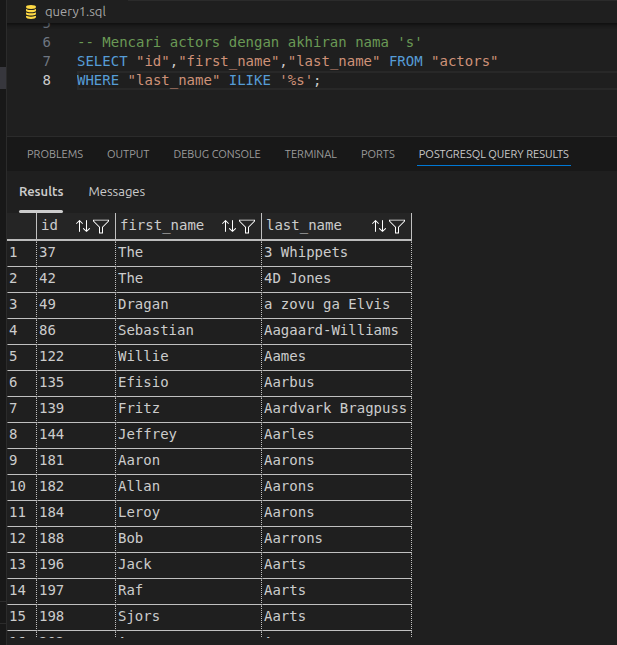
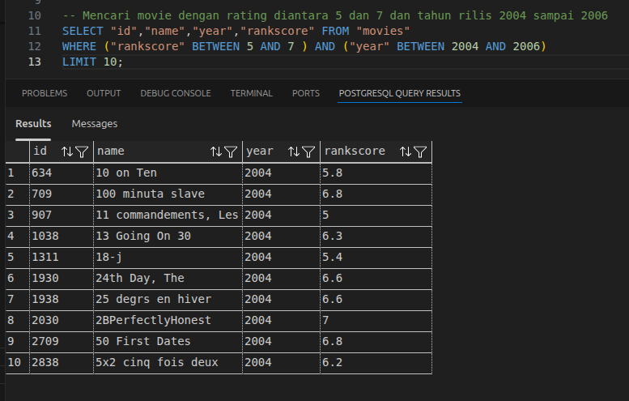
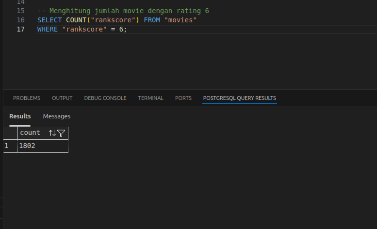

## Querying Database
1. Mencari movie dengan tahun rilis lebih dari tahun 2000

2. Mencari actors dengan akhiran nama 's'

3. Mencari movie dengan rating diantara 5 dan 7 dan tahun rilis 2004 sampai 2006

4. Menghitung jumlah movie dengan rating 6
